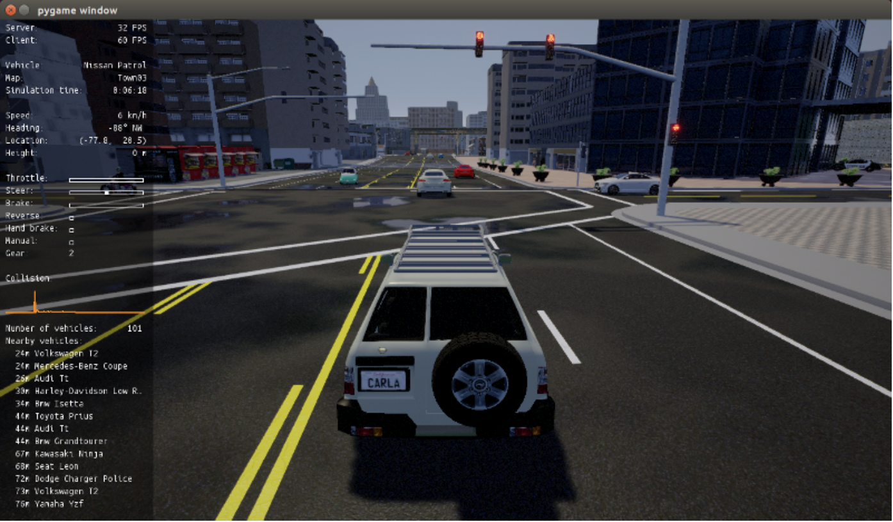

# Assignment 6

## Training A Vehicle Using Camera Feed from Vehicle Simulation

Making cars self driving has been a problem that many car companies have been trying to tackle in the 21st century.
There are many different approaches that have been used which all involve deep learning. The approaches all train data
that are gathered from a variety of sensors working together. Lidar and computer vision are the main sensors that are
used by commercial companies. Tesla uses video gathered from multiple cameras to train their neural network [^4] which
is known as HydraNet. In this project, a simulation of a real driving vehicle with a camera feed will be used to train
a neural network that will attempt to make the car drive itself. 

## Using the CARLA Simulator

The data will come from the CARLA simulator which uses the driver inputs and puts into a driving log which contains data of
the trajectory and the surroundings of the simulated vehicle. The CARLA simulator uses the the steering angle and throttle
to act much like the controllable inputs of a real vehicle. CARLA is an open-source CARLA has been developed from the ground
up to support development, training, and validation of autonomous driving systems. In addition to open-source code and protocols, 
CARLA provides open digital urban layouts, buildings, and vehicles that were created for this purpose and can be used freely.
The simulation platform supports flexible specification of sensor suites, environmental conditions, full control of all static
and dynamic actors, maps generation [^2]. The data gathered will be created by driving the vehicle in the simulator and using the
camera feed so that the neural network can be trained. The driving in the simulator looks like the image below.

### Driving in CARLA

[^3]

### Running CARLA in Google Colab

To use the CARLA Simulator in google colab we can use the open-souce github below which allows one to use a fully functioning version 
of CARLA, which requires a good GPU. Note that using this requires one to download TurboVNC and Cloudfared to be able to run CARLA remotely.
The link to the GitHub repository below provides more instructions on how to use this notebook to run CARLA.

> <https://github.com/MichaelBosello/carla-colab.git>

## Deep Learning Algorithm for Self Driving Cars

To train the neural network for the self driving car I will be using a neural network that can learn from its previous iterations much like
q-learning. This class of neural network is called deep Q-Learning and it uses reinforcement learning to map the actions and Q-values transitions
to the input states [^5]. This approach replaces the Q-table from traditional reinforcement learning with neural networks which train the decision
making process of the vehicle.

## Existing Efforts

An effort by a youtuber named Siraj Raval shows the process of training a vehicle to run autonomously using NVIDIA's end to end learning
network. A link to the video is shown below

><https://www.youtube.com/watch?v=EaY5QiZwSP4&t=1595s>

## References

[^1]:https://github.com/MichaelBosello/carla-colab.git
[^2]:http://carla.org/
[^3]:https://carla.readthedocs.io/en/0.9.7/getting_started/
[^4]:https://openaccess.thecvf.com/content_cvpr_2018/papers_backup/Mullapudi_HydraNets_Specialized_Dynamic_CVPR_2018_paper.pdf
[^5]:https://towardsdatascience.com/deep-q-learning-tutorial-mindqn-2a4c855abffc
